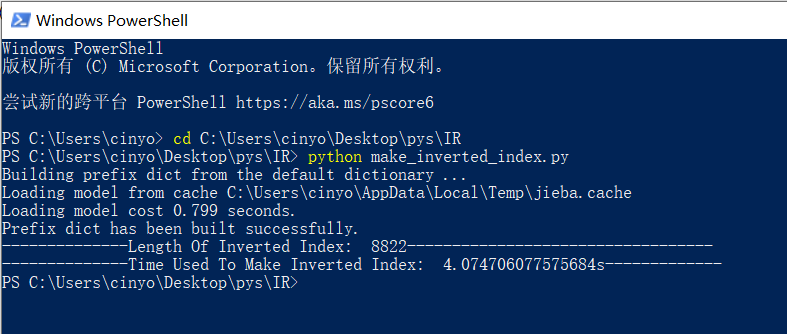
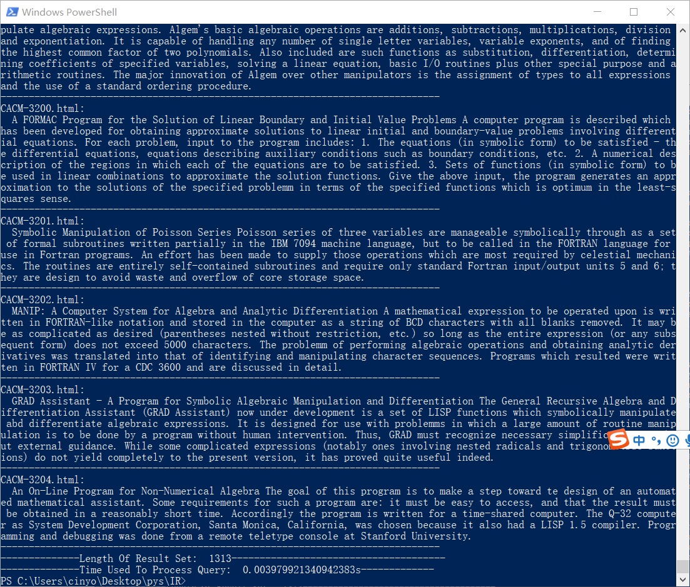
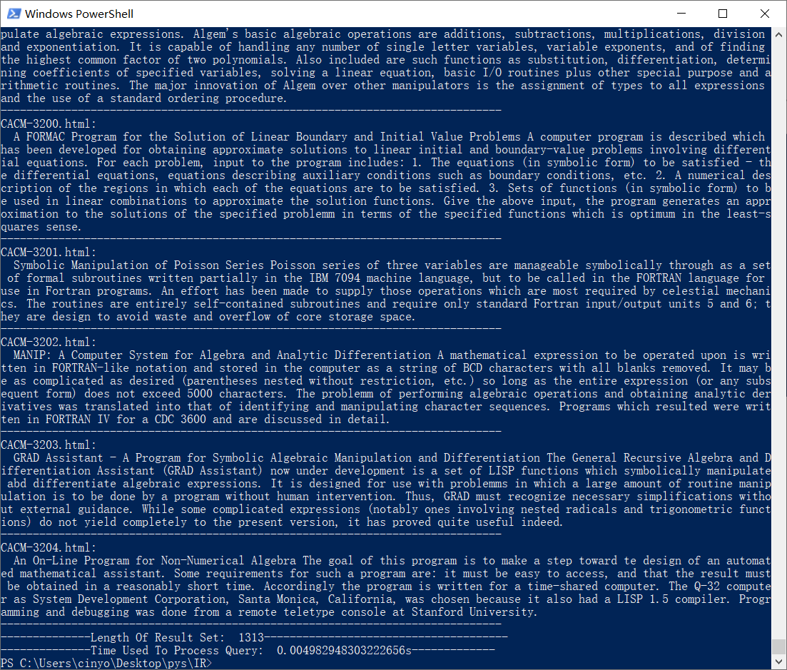

# 信息检索技术 第一次大作业

## 运行环境

* Python 3
* Windows 10

## 文件结构

* utils.py——用于储存用到的数据结构和相关函数
* make_inverted_index.py——用于构建倒排索引
* inverted_index.pkl——倒排索引文件
* main.py——主函数，用于查询
* README.txt——程序运行方式说明
* cacm——数据集

## 已实现功能

* 针对CACM数据集，建立文档的倒排索引
* 在索引中实现分词算法
* 支持Skip Pointer的AND queries

## 算法流程

### 数据结构

本次作业使用的数据结构为手动实现的Vector和Python自带的defaultdict。

其中defaultdict用于建立倒排索引模型中单词与对应Vector的映射，使用defaultdict而非dict是为了避免查询时尝试访问字典中不存在的键值而出现的Key Error。

Vector由小到大排序，其中每一个节点都储存了包含该单词的HTML编号，以及Skip Pointer后下一个节点的下标。

这里Skip Pointer的间隔按照讲义中的说法，取Vector长度的根号，用户也可以自定义间隔。

### 建立索引

1. 从数据集中每个HTML中读取内容，获得标题和摘要的内容，作为该HTML文件的信息。
2. 对提取的信息进行去除标点符号等前处理步骤，这里使用了re库。
3. 使用分词算法对前处理后的信息进行分词。这里使用的分词算法是Python库[jieba](https://www.baidu.com/link?url=dRf5xdDPaVUMRTOVMHA1eT5QC6hoB45TTh0dBTT0QIKN1ofUZMHL8RqjFys_oE1X&wd=&eqid=8191756b00049336000000065e8851de)提供的cut接口。在使用过程中发现，对于“-”连接的单词，该算法会将左右两边的单词分开，因此在单词的语义的丰富性上也许会有所损失。
4. 分词完成后，继续进行去重、转为小写字母等后处理步骤，得到该HTML文件编号对应的单词列表。
5. 对后处理后的单词列表中的每一个单词，在defaultdict中将该HTML文件编号插入到对应单词的Vector中。
6. 在倒排索引建立完成后，使用pickle库将得到的defaultdict储存为.pkl文件。

### 查询

1. 读取建立索引时得到的.pkl文件，得到倒排索引的defaultdict。

2. 读取用户输入的查询内容。这里为了方便多个单词的解析，要求用户输入的是合取范式。

3. 对合取范式进行解析，这里使用了re库进行字符串分割。首先按照AND进行分割，得到析取范式的列表。

   对于列表中的每一个析取范式，我们将逐个处理，最后使用AND的处理算法。这里用户可以选择是否使用Skip Pointer。

4. 析取范式可以分为以下几种情况：

   * 单个单词——此时直接查询对应的Vector即可。
   * 单个单词的NOT——此时可根据情况，使用上课讲到的AND_NOT的处理算法，将时间复杂度降低为O(x+y)，无法使用AND_NOT的算法时，只能老老实实遍历全部编号进行对比。
   * 多个单词的OR——此时只需要将单词对应的Vector两个两个地使用OR的查询算法即可，时间复杂度O(x+y)。
   * 多个单词的OR和NOT——此时出现了课上说过的尽量不要OR NOT一起用的情况，在这种情况出现时，只能先将NOT的单词进行遍历全部编号的处理，得到结果后，再按照上一种情况完成处理。
   
5. 最后得到结果的Vector，将每一个节点对应的文件内容输出即可。

## 实验结果

### 建立索引

索引大小为8822，即对8822个单词建立了倒排索引。

建立索引使用的时间为4秒左右。

### 查询

#### 使用Skip Pointer

为了使查询的结果集大一些，这里查找的是 in & of，结果如下：

查询结果集大小为1313，查询时间约为0.004s。

#### 不使用Skip Pointer

同样的查询内容，得到结果如下：

查询结果集大小为1313，查询时间约为0.005s。

可以看到两者情况的结果集大小都是1313，查询结果也是一致的。

在Vector较长时，Skip Pointer确实能比较明显的提升查询的速度，在本次实验中提升了20%左右。